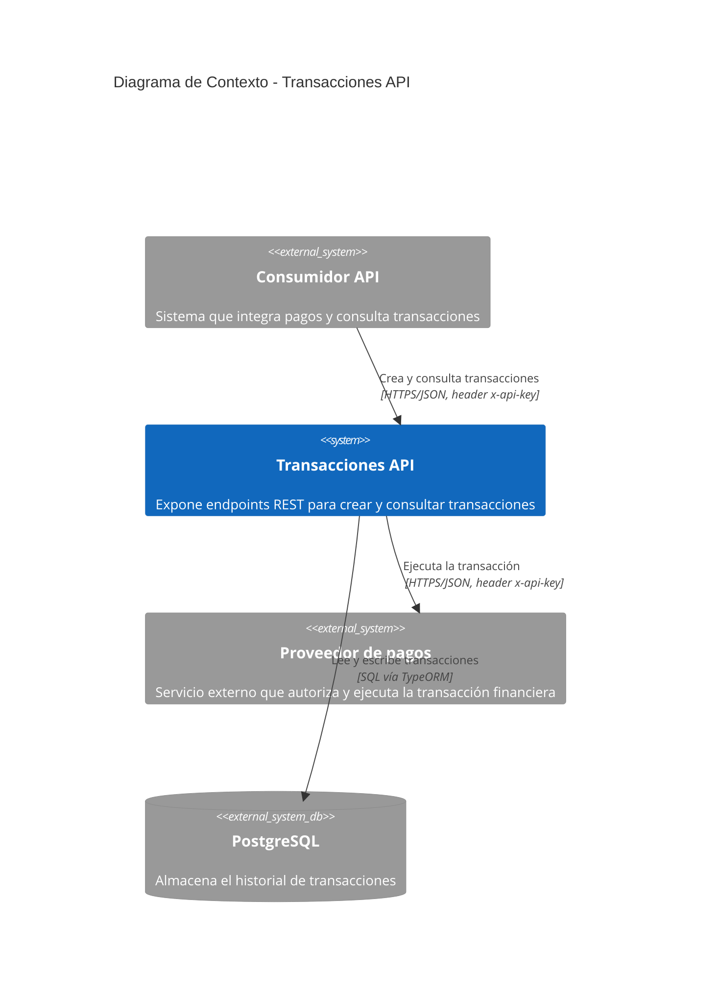
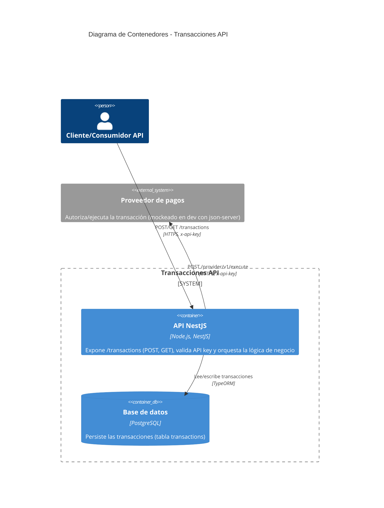
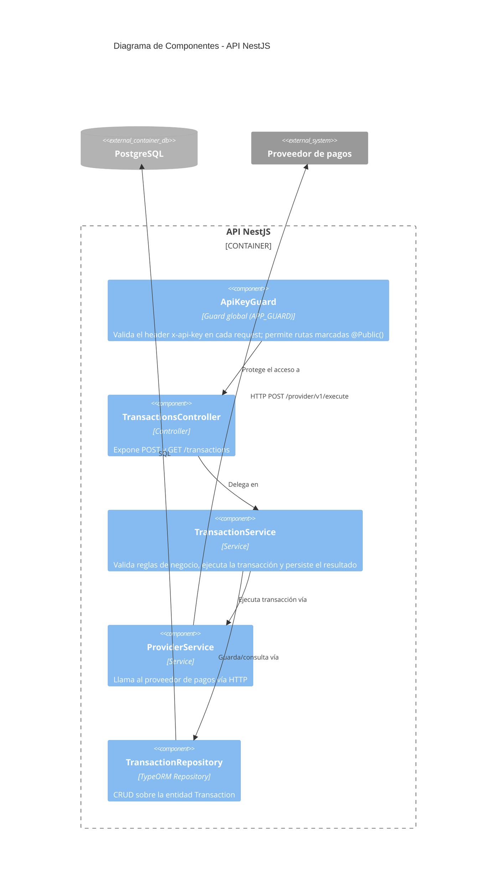

# Arquitectura (Modelo C4)

### Nivel 1 — Diagrama de Contexto

Muestra el sistema en relación con los usuarios y sistemas externos con los que interactúa.

### Nivel 2 — Diagrama de Contenedores

Desglosa el sistema "Transacciones API" en sus piezas desplegables.

### Nivel 3 — Diagrama de Componentes (contenedor "API NestJS")

